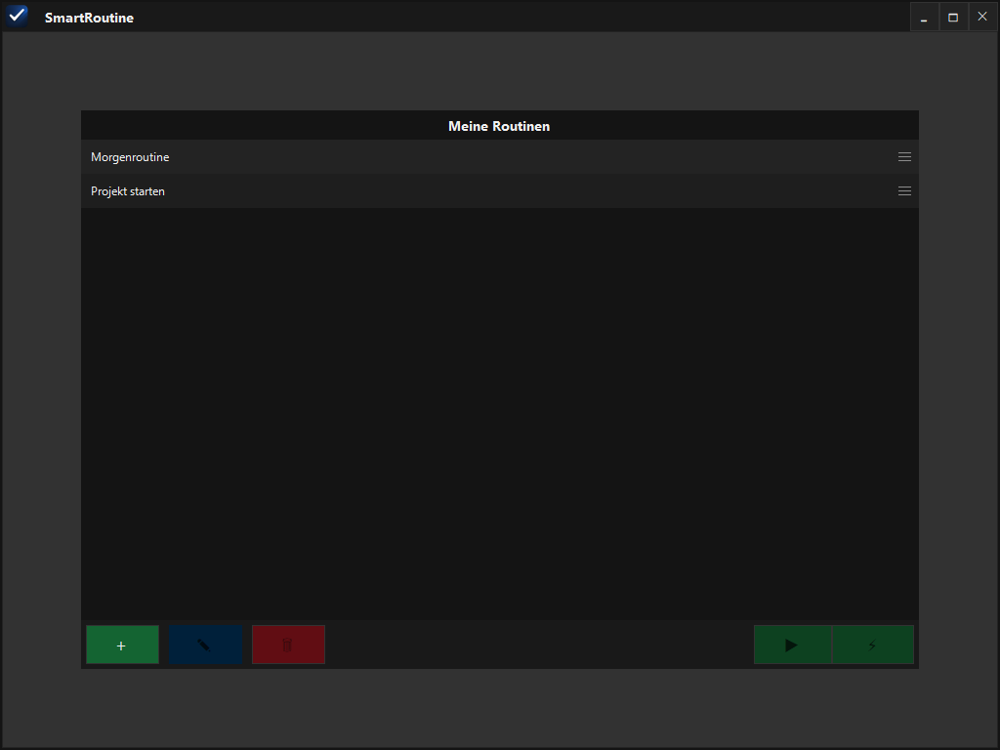
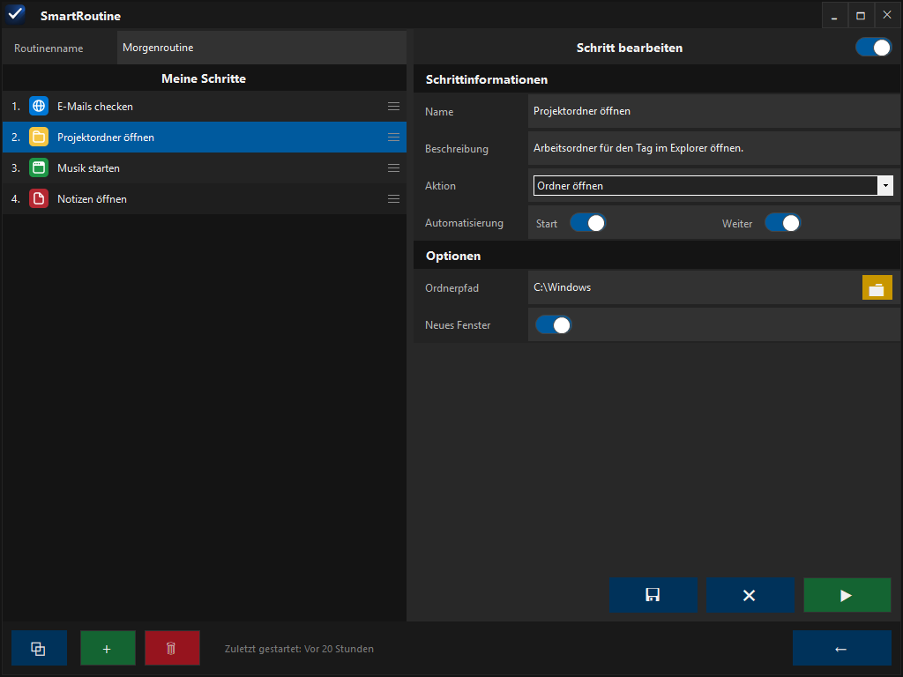

# SmartRoutine

SmartRoutine ist eine kleine Windows-Desktop-App zur Automatisierung wiederkehrender Arbeitsabläufe: Eine Routine wird einmal als Abfolge von Schritten definiert — Webseite öffnen, Ordner öffnen, Programm starten, Dokument öffnen — und lässt sich danach mit einem Klick starten.

## Funktionen

- Routinen aus beliebig vielen Schritten (Webseite, Ordner, Programm, Dokument), per Drag & Drop sortierbar
- Geführte oder automatische Ausführung
- Automatische Updates über GitHub

## Download

Aktuelle Version von der [Releases-Seite](https://github.com/Erik513/SmartRoutine/releases): `SmartRoutine.exe` herunterladen und starten, kein Installer nötig. Updates werden danach automatisch erkannt.

## Bedienung

Mit **+** eine Routine anlegen, mit **+ Schritt hinzufügen** Schritte ergänzen. Danach mit **▶** manuell durchgehen oder mit **⚡** automatisch ausführen.
